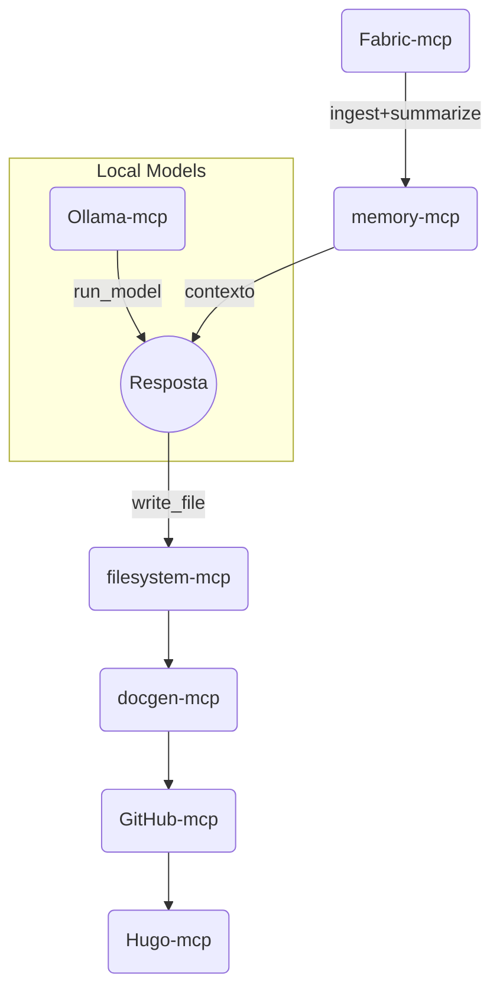

# 🧠 **MCP‑Stack** – Laboratório Completo de Servidores MCP para Fluxos com LLM

> **Versão final 2025‑06‑27**  •  Licença MIT  •  Manutenção Luiz Peixoto
>
> Este repositório consolida **10 servidores MCP** prontos para uso local com LLMs (Google Gemini CLI, Claude, Cursor, VS Code AI). Cada serviço é orquestrado via Docker Compose, com variáveis de ambiente centralizadas, scripts de gerenciamento e documentação. Um arquivo `compose.all.yml` orquestra todos em lote.

---

## 🌳 Estrutura de Diretórios

```bash
mcp-stack/
├── compose.all.yml                # Orquestra todos os MCPs
├── .env.example                   # Variáveis de ambiente centralizadas (copie para .env)
├── .gemini/settings.json          # Endpoints prontos para Google‑CLI
├── scripts/
│   ├── start_all.sh               # Sobe todos os containers
│   └── stop_all.sh                # Encerra todos
└── servers/
    ├── memory-mcp/      # Weaviate (vetores)
    ├── github-mcp/      # Integração GitHub
    ├── filesystem-mcp/  # Arquivos locais
    ├── supabase-mcp/    # Banco Supabase
    ├── obsidian-mcp/    # Notas Obsidian
    ├── zotero-mcp/      # Referências Zotero
    ├── docgen-mcp/      # Geração de docs
    ├── hugo-mcp/        # Sites Hugo
    ├── ollama-mcp/      # Modelos Ollama
    └── fabric-mcp/      # Coleta Fabric (Daniel Miessler)
```

Cada subpasta `servers/<mcp-name>/` contém:

| Arquivo              | Função                                     |
| -------------------- | ------------------------------------------ |
| `docker-compose.yml` | Definição do container + volumes + portas  |
| `README.md`          | Link upstream + instruções específicas     |

---

## 🚀 Servidores MCP (Detalhes)

Os detalhes de cada servidor, incluindo portas, repositórios e ferramentas, permanecem os mesmos. As configurações de ambiente agora são gerenciadas centralmente.

---

## 📑 Arquivos Globais

### `.env.example`

Este arquivo centraliza todas as variáveis de ambiente necessárias para os serviços MCP. Copie-o para `.env` e ajuste os valores conforme sua necessidade.

```env
# Centralized environment variables for MCP-Stack

# memory-mcp
WEAVIATE_DATA=./data

# github-mcp & docgen-mcp
GITHUB_PAT=

# filesystem-mcp
PROJECTS_ROOT=/home/$USER/Projetos

# supabase-mcp
SUPABASE_PAT=
SUPABASE_PROJECT_REF=

# obsidian-mcp
VAULT_PATH=/home/$USER/Documentos/Obsidian/Vault

# zotero-mcp
ZOTERO_API_KEY=
ZOTERO_USER_ID=

# hugo-mcp
HUGO_SITES_ROOT=/home/$USER/Sites

# ollama-mcp (no specific variables)

# fabric-mcp (no specific variables)
```

### `compose.all.yml`

Este arquivo orquestra todos os serviços MCP, utilizando `extends` para reutilizar as definições de cada `docker-compose.yml` individual. Ele também garante que as variáveis de ambiente sejam carregadas do `.env` centralizado.

### `scripts/start_all.sh`

```bash
#!/usr/bin/env bash
set -e
SCRIPT_DIR="$(cd "$(dirname "${BASH_SOURCE[0]}")" && pwd)"
docker compose -f "$SCRIPT_DIR/../compose.all.yml" up -d
```

### `scripts/stop_all.sh`

```bash
#!/usr/bin/env bash
set -e
SCRIPT_DIR="$(cd "$(dirname "${BASH_SOURCE[0]}")" && pwd)"
docker compose -f "$SCRIPT_DIR/../compose.all.yml" down
```

### `.gemini/settings.json`

```json
{
  "mcpServers": {
    "memory":     { "url": "http://localhost:9100" },
    "github":     { "url": "http://localhost:9101" },
    "filesystem": { "url": "http://localhost:9102" },
    "supabase":   { "url": "http://localhost:9103" },
    "obsidian":   { "url": "http://localhost:9104" },
    "zotero":     { "url": "http://localhost:9107" },
    "docgen":     { "url": "http://localhost:9105" },
    "hugo":       { "url": "http://localhost:9106" },
    "ollama":     { "url": "http://localhost:9108" },
    "fabric":     { "url": "http://localhost:9109" }
  }
}
```

---

## 🔥 Exemplo de Fluxo Completo



---

## ✅ Como Usar

1.  Clone o repositório e navegue até o diretório:
    `git clone <repo> mcp-stack && cd mcp-stack`
2.  Crie seu arquivo de variáveis de ambiente a partir do exemplo:
    `cp .env.example .env`
3.  Ajuste as variáveis em `.env` conforme suas necessidades (e.g., `GITHUB_PAT`, `VAULT_PATH`).
4.  Inicie todos os serviços MCP:
    `./scripts/start_all.sh`
5.  Configure o Gemini CLI para usar os endpoints dos MCPs:
    `gemini settings import .gemini/settings.json`
6.  Pergunte ao seu agente (exemplo):

    ```text
    "Use filesystem‑mcp para abrir README.md deste projeto e docgen‑mcp para gerar documentação HTML."
    ```

---

## ➕ Adicionando Novos Servidores MCP

Para adicionar um novo servidor MCP ao stack:

1.  Crie uma nova pasta em `servers/` (e.g., `servers/new-mcp/`).
2.  Dentro dela, crie um `docker-compose.yml` para o novo serviço.
3.  Adicione quaisquer variáveis de ambiente necessárias ao `.env.example` centralizado.
4.  Atualize `compose.all.yml` para incluir o novo serviço usando `extends`.
5.  Adicione o endpoint do novo serviço em `.gemini/settings.json`.

---

## 🛡️ Segurança

*   Tokens nunca vão para o Git.  
*   `filesystem-mcp` monta apenas a pasta do projeto – evite expor `~/` completo.  
*   Em produção, coloque um proxy TLS (nginx/caddy) com autenticação básica.

---

## 📅 Roadmap Futuro

-   **Melhorias Atuais:** Implementação de health checks e fixação de versões de imagens Docker para maior robustez e reprodutibilidade.
-   2025‑Q3 — integração com PostgreSQL‑mcp e Redis‑mcp  
-   2025‑Q4 — template Ansible para deploy remoto  
-   2026‑Q1 — UI web para gerenciar containers + health‑checks

---

## 🧪 Testes

Para verificar a acessibilidade e o funcionamento básico dos servidores MCP, você pode executar os testes de reachability:

1.  Instale as dependências de teste:
    ```bash
    pip install -r requirements.txt
    ```
2.  Certifique-se de que os servidores MCP estão em execução (`./scripts/start_all.sh`).
3.  Execute o script de teste:
    ```bash
    python tests/test_mcp_servers.py
    ```

---

© 2025 Luiz Peixoto — MIT